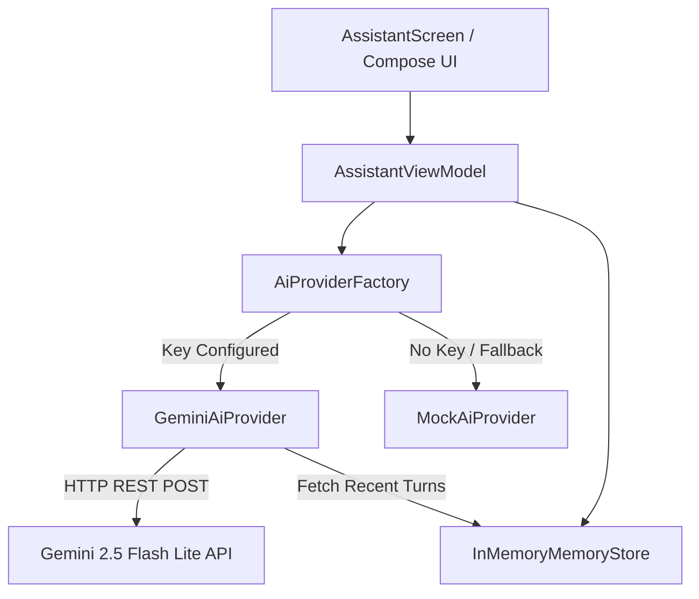

# Implementation Plan - Kumaru V0.2A (Real AI Brain)

Integrate Google Gemini 2.5 Flash Lite as the real AI reasoning brain for Kumaru, replacing `MockAiProvider` while preserving the existing Jetpack Compose UI, session memory architecture, and mock fallback capabilities.

## 1. User Review Required

> [!IMPORTANT]
> **API Key Security**: The Gemini API key will be read from `local.properties` (which is already listed in `.gitignore` and excluded from source control) and injected via Gradle `BuildConfig`. No secrets will ever be hardcoded into Kotlin source code or committed to Git.

> [!NOTE]
> **Sandbox Tooling Execution**: If the internal agent sandbox cannot execute Gradle commands due to local environment restrictions, the exact PowerShell commands to build and run the project locally will be provided.

---

## 2. Architecture & Design

1. **API Key Injection & Security**:
   - In `app/build.gradle.kts`, load `local.properties` to read `GEMINI_API_KEY` (or `gemini.api.key`) and `gemini.model`.
   - Inject `BuildConfig.GEMINI_API_KEY` and `BuildConfig.GEMINI_MODEL` (`gemini-2.5-flash-lite`).
   - Enable `buildFeatures { buildConfig = true }`.

2. **GeminiAiProvider**:
   - Implements `AiProvider`.
   - Asynchronous request execution on `Dispatchers.IO` using standard `HttpURLConnection` and `org.json` (zero bloated external dependencies).
   - Multi-turn context: converts recent conversation history from `MemoryStore` into Gemini's `contents` format (`user` / `model` roles).
   - Kumaru system instruction: configures Kumaru's personality (calm, concise, witty, helpful, understanding casual English and Tamil/Thanglish, honest about capabilities).
   - Comprehensive error recovery: handles offline network, timeouts, rate limits (HTTP 429), authentication/key errors (HTTP 400/401/403), server downtime (HTTP 500/503), safety filtering, and malformed responses without crashing.

3. **Provider Selection Mechanism**:
   - `AiProviderFactory`: dynamically instantiates `GeminiAiProvider` when `BuildConfig.GEMINI_API_KEY` is provided; seamlessly falls back to `MockAiProvider` if the key is empty or when mock mode is enabled.
   - `AssistantViewModel` delegates default provider instantiation to `AiProviderFactory`, requiring no modifications to UI or state transitions.

4. **Preserved UI State Machine**:
   - Keeps `IDLE` -> `THINKING` -> `SPEAKING` -> `IDLE` sequence intact.
   - Transcript feed, GlowingOrb, and Push-To-Talk / suggestions continue working seamlessly with real AI output.

---

## 3. Proposed Changes

### Build Configuration

#### [MODIFY] [app/build.gradle.kts](file:///c:/Users/hp/Desktop/Kumaru/app/build.gradle.kts)
- Enable `buildConfig = true` under `buildFeatures`.
- Read `GEMINI_API_KEY` and `gemini.model` from `local.properties` (with environment variable fallback).
- Expose `BuildConfig.GEMINI_API_KEY` and `BuildConfig.GEMINI_MODEL`.

---

### Data & Presentation Layer

#### [NEW] [GeminiAiProvider.kt](file:///c:/Users/hp/Desktop/Kumaru/app/src/main/java/com/kumaru/assistant/data/ai/GeminiAiProvider.kt)
- Create `GeminiAiProvider` implementing `AiProvider`.
- Inject `apiKey`, `model`, and `memoryStore: MemoryStore?`.
- Construct Gemini REST request with `system_instruction`, multi-turn message history, and generation config.
- Add robust JSON response parsing and user-friendly error translations.

#### [NEW] [AiProviderFactory.kt](file:///c:/Users/hp/Desktop/Kumaru/app/src/main/java/com/kumaru/assistant/data/ai/AiProviderFactory.kt)
- Create factory to select between `GeminiAiProvider` and `MockAiProvider`.

#### [MODIFY] [AssistantViewModel.kt](file:///c:/Users/hp/Desktop/Kumaru/app/src/main/java/com/kumaru/assistant/presentation/viewmodel/AssistantViewModel.kt)
- Update default constructor parameters to use `AiProviderFactory.create(memoryStore)`.

---

### Documentation

#### [MODIFY] [README.md](file:///c:/Users/hp/Desktop/Kumaru/README.md)
- Document V0.2A real AI brain capabilities.
- Detail how to configure the local Gemini API key in `local.properties`.
- Add build, run, and mock-switch instructions.

---

## 4. Verification Plan

### Manual Verification & Testing
1. **Local Properties Configuration**:
   - Add `GEMINI_API_KEY=YOUR_ACTUAL_KEY` to `local.properties`.
2. **Build Validation**:
   - Run `.\gradlew.bat assembleDebug` in PowerShell.
3. **Conversational Test Questions**:
   - Test 1 (Personality & Intro): *"Who are you and what can you do?"*
   - Test 2 (Multi-turn Context):
     - Question 1: *"What is the capital of Japan?"*
     - Question 2: *"How far is it from Bangalore?"* (Verify reference to Tokyo).
   - Test 3 (Tamil/Thanglish & Capabilities): *"Enna Kumaru, can you order food for me?"* (Verify polite clarification of current limits and Tamil slang comprehension).
4. **Mock Fallback Verification**:
   - Verify that removing or clearing `GEMINI_API_KEY` falls back cleanly to `MockAiProvider`.

